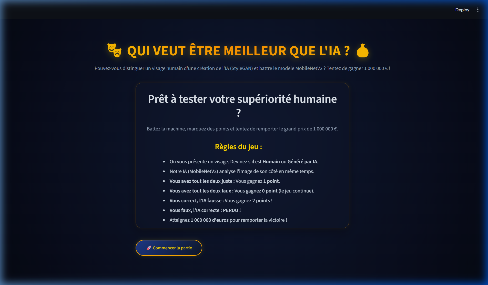
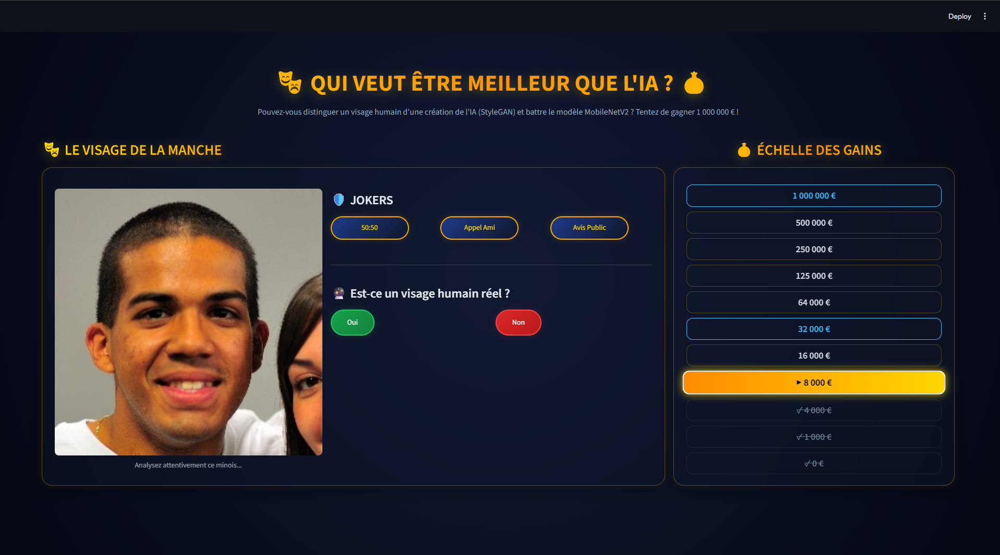

# Projet de Détection de Deepfakes – Qui veut être meilleur que l'IA ?

### Membres du Groupe

* Paul Sode
* Jules Araud
* Mohamed Hamza Laamarti

---

# Présentation du projet

Ce projet a été réalisé dans le cadre du module **Deep Learning**.

L'objectif est de développer un système intelligent capable de classifier automatiquement des images de visages afin de détecter s'ils appartiennent à la catégorie :

* **REAL** (Visages humains réels)
* **FAKE** (Visages générés artificiellement par StyleGAN)

Le projet couvre l'ensemble du cycle de vie d'un projet Data Science :

* Acquisition et préparation des données
* Analyse exploratoire (EDA)
* Machine Learning classique (Baseline régularisée)
* Deep Learning fondamental (CNN personnalisé entraîné de zéro)
* Deep Learning avancé (Transfer Learning avec MobileNetV2)
* Déploiement sous forme de dashboard interactif sous le format du jeu *"Qui veut gagner des millions"*

---

# Dataset utilisé

Dataset Kaggle :

**140k Real and Fake Faces**

https://www.kaggle.com/datasets/xhlulu/140k-real-and-fake-faces

Le dataset contient 140 000 images réparties de manière équilibrée dans deux classes :

| Classe | Description |
| ------ | ----------- |
| **REAL** | Visages humains réels extraits de la base FFHQ |
| **FAKE** | Visages générés par le modèle de génération d'images StyleGAN |

Le dataset est structuré ainsi :

```text
real_vs_fake/
  ├── real/
  └── fake/
```

*Note : Le dataset n'est pas inclus dans le dépôt Git pour éviter de versionner des fichiers trop lourds. Le notebook le télécharge et le charge de manière automatique ou via cache local.*

---

# Structure du projet

```text
deepfake_detection-main/
│
├── assets/
│   ├── rules_screen.png              # Capture d'écran des règles du dashboard
│   └── gameplay_screen.png           # Capture d'écran du plateau de jeu interactif
│
├── artifacts/
│   └── deepfake_mobilenetv2.keras    # Modèle MobileNetV2 final sauvegardé
│
├── deepfake_detection_2026.ipynb     # Notebook Jupyter principal (Rapport Complet)
├── models.py                          # Définition des architectures CNN et MobileNetV2
├── app.py                             # Interface de jeu interactive sous Streamlit
├── requirements.txt                   # Dépendances logicielles du projet
└── README.md                          # Documentation de référence du projet
```

---

# Partie 1 — Data Science & Baseline Machine Learning

## Acquisition et préparation

Les données ont été chargées de manière automatisée.

Contrôles et étapes de préparation réalisés :
* Vérification de l'intégrité et du format des fichiers d'images (JPEG/PNG) ;
* Redimensionnement systématique pour s'adapter aux baselines classiques ;
* Normalisation des valeurs de pixels entre `[0, 1]` pour stabiliser l'entraînement des modèles.

---

## Analyse exploratoire (EDA)

Plusieurs visualisations et constats ont été faits :
* Les visages réels (FFHQ) possèdent des textures de peau et des arrière-plans naturels ;
* Les visages générés (StyleGAN) présentent des artéfacts typiques : asymétrie subtile des pupilles, raccords étranges au niveau des oreilles ou des bijoux, et arrière-plans flous et chaotiques ;
* Les images doivent être redimensionnées à 32x32 pour les modèles de Machine Learning classique afin de limiter le coût computationnel.

---

## Baseline Machine Learning

Pour servir de référence minimale (baseline), plusieurs modèles de régression logistique régularisée ont été entraînés après vectorisation complète des images (redimensionnées en 32x32) :

* **Logistic Regression Ridge (L2)**
* **Logistic Regression Lasso (L1)**
* **Logistic Regression ElasticNet**

### Meilleur modèle classique
Le meilleur modèle classique obtenu est la **Régression Logistique avec régularisation Lasso (L1)** :

* **Accuracy sur Test :** ~74.5%
* **AUC score :** 0.831

Bien que solide pour un modèle linéaire simple, cette baseline souffre de la perte d'informations spatiales due à l'aplatissement (flattening) des images 2D en vecteurs plats de caractéristiques.

---

# Partie 2 — Deep Learning Fondamental

## Architecture CNN

Afin d'exploiter les relations spatiales des pixels, une architecture de réseau de neurones convolutifs (CNN) a été conçue (définie dans `models.py`).

Le réseau comporte :
* Des couches de convolution 2D pour apprendre des caractéristiques locales de bas niveau (bords, textures, contrastes) ;
* Des activations ReLU pour la non-linéarité ;
* Des couches MaxPooling pour réduire la dimensionnalité spatiale ;
* Une couche Global Average Pooling pour compresser la carte de caractéristiques finale ;
* Une couche Dense de sortie activée par une Sigmoid pour la prédiction binaire (REAL/FAKE).

### Justification du choix du CNN
L'utilisation de convolutions permet de conserver les motifs de voisinage (2D), essentiels pour identifier les imperfections locales produites par StyleGAN (micro-flous, aberrations de contours) que la régression logistique classique ne parvient pas à distinguer.

---

# Partie 3 — Deep Learning Avancé & Déploiement

## Transfer Learning

Afin d'obtenir les meilleures performances de détection, nous avons mis en œuvre une approche de **Transfer Learning** basée sur le modèle pré-entraîné **MobileNetV2** (poids issus d'ImageNet).

La base du modèle est gelée pour conserver les extracteurs de caractéristiques génériques, et une tête de classification personnalisée est entraînée sur nos images de visages. Un fine-tuning partiel est ensuite réalisé sur les couches supérieures pour affiner les performances de classification.

Le modèle entraîné est sauvegardé sous `artifacts/deepfake_mobilenetv2.keras`.

---

## Dashboard Interactif (Streamlit)

**Technologie utilisée :** Streamlit

Nous avons développé une application ludique sous le format d'un jeu télévisé ("Qui veut gagner des millions") appelée **"Qui veut être meilleur que l'IA ?"**.

### Fonctionnalités principales :
* **Humain vs IA :** Vous devez prédire si le visage affiché est réel ou généré, en même temps que notre IA forte MobileNetV2.
* **Échelle des gains :** Les paliers de prix montent jusqu'à 1 000 000 €.
* **Jokers implémentés :**
  * **50:50 :** Surchauffe et ajoute des boutons de choix synonymes (ex: *Absolument*, *Aucunement*, *Que nenni*) au lieu d'en enlever.
  * **Appel à un Ami :** Interroge en temps réel notre modèle CNN plus faible entraîné localement et affiche son avis.
  * **Avis du Public :** Simule le vote du public sous forme de graphique en barres.
* **Synonymes dynamiques :** L'image affiche une légende dynamique à chaque round avec des synonymes variés de visage (ex: *cette frimousse*, *ce minois*, *ce portrait*, *ce faciès*), préservant les accords grammaticaux.

### Aperçu du Dashboard :

* **Écran de règles d'introduction :**
  

* **Plateau de jeu actif :**
  

---

# Résultats Finaux

| Modèle / Approche | Accuracy sur Test | AUC score | Commentaire / Rôle |
| :--- | :---: | :---: | :--- |
| **Baseline Lasso (L1)** | ~74.5% | 0.831 | Modèle linéaire simple, rapide mais limité |
| **CNN Custom (from scratch)** | Variable | Moyen | Apprend les motifs convolutifs, coût moyen |
| **MobileNetV2 (Transfer Learning)** | **Excellent** | **Très élevé** | IA forte servant de référence sur le dashboard de jeu |

### Analyse des résultats
Les résultats montrent une amélioration logique : la baseline Lasso souffre du flattening des images. Le CNN custom améliore la précision en traitant le visage sous forme spatiale 2D. Enfin, le Transfer Learning avec MobileNetV2 tire profit des filtres pré-entraînés pour s'ajuster avec précision aux imperfections visuelles des fausses images StyleGAN, offrant le meilleur taux de réussite.

---

# Installation & Lancement

### 1. Environnement Virtuel
Créez un environnement virtuel Python :
```bash
python -m venv .venv
```

Activez-le :
* **Windows :**
  ```bash
  .venv\Scripts\activate
  ```
* **Linux / macOS :**
  ```bash
  source .venv/bin/activate
  ```

### 2. Dépendances
Installez les dépendances listées dans `requirements.txt` :
```bash
pip install -r requirements.txt
```

### 3. Exécution
* **Lancer le Notebook :**
  ```bash
  jupyter notebook deepfake_detection_2026.ipynb
  ```
* **Lancer l'Application Streamlit :**
  ```bash
  streamlit run app.py
  ```

---

# Transparence IA
Des outils d'assistance IA ont été exploités pour aider à l'élaboration et la correction des styles CSS Streamlit, structurer les notebooks de rendu, générer les synonymes dynamiques et aider à l'intégration continue (CI). Tous les codes et choix méthodologiques ont été revus et validés manuellement par les membres du groupe.

---

# Limites & Pistes d'amélioration
* **Généralisation :** Le modèle a été entraîné sur StyleGAN. Il peut avoir appris des caractéristiques de bruit spécifiques à ce générateur et moins bien généraliser sur d'autres techniques de génération (ex: Diffusion de Stable Diffusion ou Deepfakes vidéos par échange de visages).
* **Pistes futures :** Enrichir le dataset avec d'autres architectures de génération d'images, intégrer de la détection de deepfakes temporels (vidéo), et explorer des architectures plus lourdes comme EfficientNet ou des Vision Transformers (ViT).
